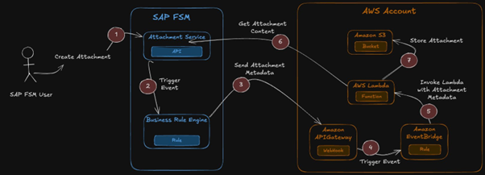
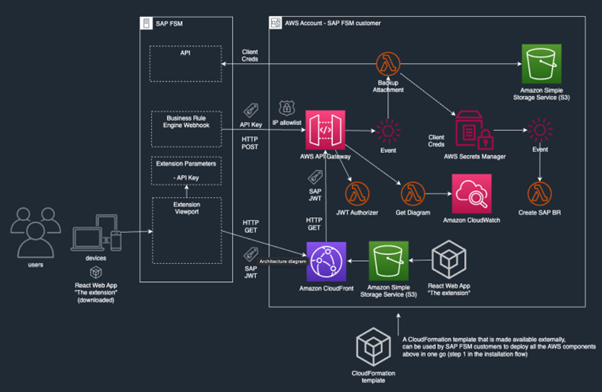

---
title: "Blog 1.Mở rộng SAP Field Service Management với AWS: Cách tiếp cận Clean Core cho việc lưu trữ tệp đính kèm"
date: "2025-07-07"
weight: 1
chapter: false
pre: " <b> 3.1. </b> "
categories: ["SAP trên AWS"]
authors: ["Francesco Bersani", "Otto Kruse", "Peter Daukintis"]
---

Chuyển đổi số trong các hoạt động dịch vụ tại chỗ đã dẫn đến sự gia tăng nhanh chóng trong việc tạo ra tài sản kỹ thuật số và kéo theo đó là nhu cầu về lưu trữ. Các tổ chức sử dụng SAP Field Service Management (SAP FSM) đang đối mặt với thách thức ngày càng lớn trong việc quản lý hiệu quả các tài sản kỹ thuật số được ghi lại bởi kỹ thuật viên dịch vụ tại chỗ. Các tài sản này có thể bao gồm hình ảnh thiết bị, biểu mẫu, chữ ký khách hàng và các tài liệu quan trọng khác được xử lý ngay tại nơi làm việc. Bài viết này minh họa cách tận dụng Amazon Web Services (AWS) để tạo ra một giải pháp lưu trữ tệp đính kèm có khả năng mở rộng, tiết kiệm chi phí cho SAP FSM, đồng thời tuân thủ nguyên tắc **SAP Clean Core Extensibility**.

---

## Tổng quan

Các hoạt động dịch vụ ngay tại chỗ tạo ra một lượng lớn tệp đính kèm trong suốt quá trình làm việc hàng ngày. Mặc dù SAP FSM có khả năng lưu trữ gốc, nhiều tổ chức vẫn cần thêm không gian lưu trữ, giải pháp linh hoạt hơn và tiết kiệm chi phí hơn, cho phép họ duy trì quyền sở hữu dữ liệu để đáp ứng các yêu cầu tuân thủ, đồng thời cho phép tích hợp với các quy trình kinh doanh khác. Bằng cách tích hợp SAP FSM với hạ tầng AWS của tổ chức, giải pháp này giúp doanh nghiệp duy trì quyền kiểm soát dữ liệu của mình, đồng thời mở ra khả năng xử lý và phân tích nâng cao để khai thác tối đa giá trị từ các tài sản được tạo ra tại nơi làm việc.

Giải pháp tích hợp được đề xuất trong bài viết này cho phép các tổ chức lưu trữ các tệp đính kèm được tạo trong SAP FSM vào **Amazon Simple Storage Service (S3)** bucket trong tài khoản AWS riêng của họ, đảm bảo quyền sở hữu dữ liệu và giảm dung lượng dữ liệu trong SAP FSM. Ngoài ra, tổ chức có thể triển khai các quy trình xử lý và phân tích dữ liệu nâng cao trên các tệp đính kèm được lưu trữ bằng cách tận dụng các dịch vụ của AWS như **Amazon Textract** cho việc trích xuất văn bản, **Amazon Rekognition** cho việc phân tích hình ảnh, hoặc **Amazon Comprehend** cho việc xử lý ngôn ngữ tự nhiên. Việc có toàn quyền kiểm soát các tài sản này cũng là bước khởi đầu để xây dựng các giải pháp phức tạp hơn bằng cách tận dụng **Large Language Models (LLMs)** và tích hợp Knowledge Base, nhằm thu được những thông tin có giá trị và mang tính ngữ cảnh trong các quy trình dịch vụ và vận hành hiện trường khác.

---

## Cách hoạt động (How it works)

Quy trình bắt đầu tại chỗ làm việc, nơi kỹ thuật viên dịch vụ hoàn thành công việc tại địa điểm khách hàng. Sử dụng thiết bị di động của họ cùng ứng dụng SAP FSM, họ chụp lại các tài liệu quan trọng. Khi họ nhấn nút “upload” trong ứng dụng FSM, họ đã kích hoạt một chuỗi sự kiện được thiết kế để đảm bảo rằng tài liệu được lưu trữ an toàn và có thể truy cập trong phạm vi tổ chức.

[Hình 1: Cách hoạt động]

Khi tệp đính kèm được tải lên SAP FSM, bộ máy quy tắc nghiệp vụ của hệ thống sẽ ngay lập tức phát hiện nội dung mới. Quy tắc nghiệp vụ này trích xuất các thông tin quan trọng về tệp đính kèm (mã định danh duy nhất, tên tệp, mô tả, dấu thời gian và mối liên hệ với yêu cầu dịch vụ).

Sau đó, quy tắc gửi yêu cầu HTTPS chứa metadata của tệp đến **API endpoint chuyên dụng** trong môi trường AWS của khách hàng. API này, được xây dựng trên **Amazon API Gateway**, được bảo vệ bằng API key duy nhất cho đối tượng thuê SAP FSM, và chỉ cho phép truy cập từ các IP được phép của môi trường SAP FSM.

Khi nhận được metadata, API sẽ đưa sự kiện này lên **Amazon EventBridge (EventBridge)**. Việc xử lý sự kiện này diễn ra bất đồng bộ thông qua hàm **AWS Lambda (Lambda )** – bộ xử lý tệp đính kèm. Hàm Lambda này thực hiện các nhiệm vụ quan trọng theo trình tự:

1.  Xác thực với SAP FSM bằng **OAuth2 credentials** được lưu trong **AWS Secrets Manager**.
2.  Truy xuất nội dung thực tế của tệp đính kèm thông qua **SAP FSM Attachment API**.
3.  Xử lý nội dung, kết hợp nó với metadata gốc, và lưu tất cả vào **Amazon S3 bucket** được chỉ định.

Dưới đây là sơ đồ kiến trúc chi tiết:

[Hình 2: Kiến trúc tham chiếu]

Giải pháp này cho phép khách hàng FSM xem các chỉ số vận hành (operational metrics) về việc sao lưu tệp đính kèm vào Amazon S3, và có thể được cài đặt như một tiện ích mở rộng SAP FSM.

---

## Tiện ích mở rộng Admin (Extension UI)

Tiện ích mở rộng này là một trang web được xây dựng bằng **React**, được lưu trữ trên **Amazon CloudFront** và **Amazon S3**. Quản trị viên SAP FSM có thể dễ dàng cài đặt extension trực tiếp từ SAP FSM Extension Catalog. Tiện ích mở rộng cung cấp khả năng hiển thị thời gian thực về các chỉ số lưu trữ trên S3, với **bảng điều khiển Amazon CloudWatch** tích hợp sẵn, giúp quản trị viên theo dõi các chỉ số quan trọng.

### Xác thực Tiện ích mở rộng (JWT Authorizer)

Vì tiện ích mở rộng chạy trong `iframe` bên trong SAP FSM, nó sử dụng một mẫu xác thực mới:

1.  Tiện ích mở rộng sử dụng **SAP FSM SDK** để lấy một **token ngắn hạn (JWT)** cho người dùng, được SAP FSM ký mã hóa.
2.  Token này được dùng để ủy quyền các yêu cầu từ tiện ích mở rộng đến **AWS API Gateway**.
3.  Giải pháp bao gồm một **Lambda Custom Authorizer** (trình ủy quyền tùy chỉnh). Lambda này sử dụng thư viện `aws-jwt-verify` để xác minh token, kiểm tra chi tiết đối tượng thuê (ID tài khoản và ID công ty) và chữ ký số.

---

## Bắt đầu triển khai

Các bước tổng quan của quá trình triển khai bao gồm:

1.  Xem lại các yêu cầu tiên quyết.
2.  Triển khai giải pháp bằng các mẫu **CloudFormation** được cung cấp trong vùng AWS của bạn.
3.  Cấu hình thông tin xác thực **OAuth2** trong SAP FSM.
4.  Cài đặt và cấu hình tiện ích mở rộng trong SAP FSM Extension Marketplace.
5.  Giám sát việc triển khai thông qua bảng điều khiển **CloudWatch** được cung cấp.

---

## Tổng quan chi phí (Cost Overview)

Chi phí liên quan đến việc triển khai và sử dụng giải pháp này phụ thuộc chủ yếu vào số lượng tệp đính kèm được tạo trong FSM.

| Giả định                               | Giá trị                  | Chi tiết  |
| :------------------------------------- | :----------------------- | :-------- |
| Số lượng tệp đính kèm được tạo         | 100.000                  | Mỗi tháng |
| Dung lượng tệp đính kèm (GB)           | 100                      | Mỗi tháng |
| Số lượng yêu cầu HTTP cho Extension UI | 10.000                   | Mỗi tháng |
| Khu vực AWS                            | eu-central-1 (Frankfurt) |           |

**Kết quả:**

- **Tổng chi phí hàng tháng:** 6,81 USD
- **Tổng chi phí hàng năm:** 81,72 USD

| Mô tả                                                            | Dịch vụ AWS        | Hàng tháng (USD) | Hàng năm (USD) |
| :--------------------------------------------------------------- | :----------------- | :--------------- | :------------- |
| Phân phối                                                        | Amazon CloudFront  | 0.23             | 2.76           |
| S3 Bucket (webapp)                                               | S3 Standard        | 0.07             | 0.84           |
| S3 Bucket (attachments)                                          | S3 Standard        | 3.04             | 36.48          |
| Event Bus                                                        | Amazon EventBridge | 0.10             | 1.20           |
| REST API Gateway                                                 | Amazon API Gateway | 0.37             | 4.44           |
| Metrics                                                          | Amazon CloudWatch  | 3.01             | 36.12          |
| _Các chức năng Lambda (Authorizer, Create BR, Store Attachment)_ | _AWS Lambda_       | _0_              | _0.00_         |
| _Data Transfer_                                                  | _S3_               | _0_              | _0.00_         |

---

## Kết luận

Việc tích hợp giữa SAP Field Service Management với AWS chứng minh rằng các tổ chức có thể tận dụng các dịch vụ đám mây gốc để xây dựng những giải pháp có khả năng mở rộng, an toàn và tiết kiệm chi phí, trong khi vẫn duy trì cách tiếp cận **clean core (lõi sạch)**. Giải pháp này không chỉ giải quyết các thách thức lưu trữ hiện tại mà còn mở ra cơ hội cho phân tích và xử lý dữ liệu nâng cao thông qua các dịch vụ AWS.

### Lợi ích chính:

- Giảm dung lượng dữ liệu trong SAP FSM
- Tăng quyền kiểm soát và chủ quyền dữ liệu
- Lưu trữ mở rộng và tiết kiệm chi phí thông qua S3
- Giám sát và quan sát tích hợp sẵn
- Tiềm năng tích hợp AI/ML và phân tích nâng cao
- Trải nghiệm người dùng liền mạch cho kỹ thuật viên tại nơi làm việc

Kiến trúc **không máy chủ (serverless)** của giải pháp đảm bảo chi phí vận hành tối thiểu.

---

## Tham gia thảo luận SAP trên AWS

Bạn có thể tham khảo thêm tại diễn đàn trao đổi công khai **re:Post Site** và mục **AWS Serverless blog**.
