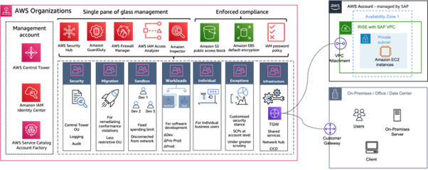

---
title: "Blog 2. Building Enterprise-Ready Hybrid Network Connectivity on AWS for SAP Cloud ERP Private (formerly known as RISE with SAP)"
date: "2025-06-30"
weight: 1
chapter: false
pre: " <b> 3.2. </b> "
categories:
  [
    "AWS Direct Connect",
    "AWS Site-to-Site VPN",
    "AWS Transit Gateway",
    "Best Practices",
    "SAP on AWS",
  ]
authors: ["Zachary Daniels"]
---

## Introduction

Are you ready to unlock the full potential of your SAP workloads on AWS? Let’s solve one of the most crucial pieces of the puzzle: establishing secure, reliable network connectivity between your company networks and your cloud ERP workloads.

At AWS, as we’ve helped customers implement their **SAP Cloud ERP Private** workloads (formerly known as RISE with SAP), three questions understandably emerge:

- “How do we establish secure connections to our private cloud ERP environments?”
- “What’s the most cost-effective network architecture for our use case?”
- “Should we implement **Direct Connect, Site-to-Site VPN**, or both?”

Network connectivity decisions made today will impact your SAP operations for years to come, affecting everything from system performance to disaster recovery capabilities. In this guide, we’ll cut through the complexity and show you how to connect your existing infrastructure to AWS for SAP Cloud ERP Private.

---

## Getting Started: Understand the Shared Responsibility Model

When implementing workloads for SAP Cloud ERP Private, the responsibilities are split:

- **SAP** manages the AWS environment where Cloud ERP Private operates.
- **You** manage the network connectivity between your infrastructure and the SAP Cloud ERP Private environment in AWS.

This division means you need a clear connectivity strategy before your implementation begins.

## Let’s Meet Your Business Needs

Every organization has unique requirements. We see these three starting points:

1.  **Focused Implementation:** Prioritizes simplicity and security for rapid deployment.
2.  **Existing AWS Infrastructure:** Integrates SAP Cloud ERP Private into an existing network architecture.
3.  **Multi-Region Operations:** Requires sophisticated, multi-region networking with enhanced control and automation.

---

## What This Post Covers

We’ll walk through three connectivity architectures that align with different business requirements:

1.  **Foundation Architecture:** A streamlined, secure solution ideal for rapid deployment.
2.  **Integrated Architecture:** A hybrid approach that optimizes existing AWS investments and provides automated failover.
3.  **Comprehensive Architecture:** An enterprise landing zone approach for complex, multi-region deployments with advanced automation.

---

## Option 1: Building Mission-Critical Connectivity with AWS Direct Connect

When your SAP workloads demand consistent, high-performance connectivity, **AWS Direct Connect (DX)** delivers. This solution provides dedicated, private network connections between your infrastructure and SAP Cloud ERP Private on AWS.

### Why Choose Direct Connect?

For mission-critical SAP environments, DX offers:

- Consistent low-latency performance
- Predictable network behavior
- Dedicated bandwidth
- Enhanced security through private connectivity

### Consider DX when you need:

- Production SAP environments requiring consistent low-latency performance.
- Regular large-volume data transfers (2+ TB daily).
- Predictable response times for mission-critical operations.

### Choosing Your Direct Connection Option:

1.  **Hosted Connections:** Fast deployment through AWS Direct Connect Partners. Ideal for most SAP Cloud ERP Private deployments.
2.  **Dedicated Connections:** Maximum control, custom bandwidth up to 100 Gbps. Recommended for high-volume, latency-sensitive workloads.

**Important Security Note:** Neither connection type includes built-in encryption. Consider implementing additional security measures such as **MacSec** for enhanced protection.

### Building Resilient Connectivity

For mission-critical workloads, implement multiple DX connections for high availability:

- Use the **AWS Direct Connect Resiliency Recommendations** to choose your optimal model.
- Implement the **AWS Direct Connect Resiliency Toolkit** for redundant connections.

---

## Option 2: Optimize Cost and Reliability with Direct Connect + VPN Failover

By combining **AWS Direct Connect** with **Site-to-Site VPN**, you can create a resilient network architecture that balances performance with cost-effectiveness.

### Building Your Hybrid Connection Strategy

- **Direct Connect** serves as the primary path (consistent performance).
- **AWS Site-to-Site VPN** stands ready as an automatic failover option, providing encrypted connectivity through the internet.

### Getting Started with Site-to-Site VPN

The key advantage of incorporating AWS Site-to-Site VPN is its rapid deployment capability (within days).

The VPN connection provides:

- Built-in **IPSec encryption** for secure data transfer.
- Flexible bandwidth based on your internet connection.
- **Pay-as-you-go** pricing model.

### Making the Right Choice for Your Business

This hybrid approach works particularly well for organizations that need to:

- Balance performance requirements with budget constraints.
- Support remote offices with varying bandwidth needs.
- Establish disaster recovery capabilities.

---

## Option 3: Building an Enterprise Foundation with AWS Landing Zone

When your journey to SAP Cloud ERP Private is part of a broader cloud strategy, implementing an **AWS Landing Zone** creates a foundation that grows with your business.

### Why Consider a Landing Zone Approach?

A landing zone is a **well-architected, multi-account AWS environment** that follows best practices. It provides:

- Centralized security controls and monitoring.
- Standardized network architecture.
- Consistent governance across regions.
- Flexible integration options.

The **Landing Zone Accelerator (LZA)** helps you implement this foundation quickly and securely.

### Creating Your Connected Environment

Within your landing zone, **AWS Transit Gateway** serves as a central hub for network traffic, allowing you to:

- Connect multiple VPCs.
- Integrate on-premises networks.
- Implement consistent security policies.
- Monitor traffic patterns centrally.
- Scale connectivity as needed.

### Real-World Applications

Organizations implement a landing zone approach when they:

- Need to maintain strict security and compliance standards.
- Plan to expand beyond core SAP workloads (e.g., IoT, analytics).
- Operate across multiple geographic regions.

---

## Bringing It All Together: Building Your Optimal Network Strategy

AWS offers flexible connectivity options that can be combined to match your specific needs:

| Combination                                          | Key Benefits                                                      |
| :--------------------------------------------------- | :---------------------------------------------------------------- |
| **DX + VPN** (Options 1 + 2)                         | Performance, Resilience, Cost-effective global reach.             |
| **Landing Zone + DX** (Options 3 + 1)                | Maximum control, Highest availability, Future-ready foundation.   |
| **Landing Zone + Hybrid** (Options 3 + 2)            | Scalable architecture, Smart cost management, Automated failover. |
| **Complete Enterprise Solution** (Options 1 + 2 + 3) | Maximum flexibility, Full redundancy, Global reach.               |

### Taking Action: Your Next Steps

1.  **Assess Your Requirements:** Map current network requirements, document performance needs, and consider future growth.
2.  **Plan Your Approach:** Select your connectivity strategy, define implementation phases, and align stakeholders.
3.  **Prepare for Implementation:** Create technical requirements, engage AWS early, and develop testing plans.

## Conclusion:

Your journey to successful AWS for SAP Cloud ERP Private connectivity begins with a single step. Contact your AWS account team or open a case in the AWS Support Portal to start building your optimal network architecture.

---

## Tài nguyên bổ sung (Additional Resources):

- Guidance for Building an Enterprise-Ready Network Foundation for RISE with SAP on AWS
- AWS Direct Connect + AWS Transit Gateway + AWS Site-to-Site VPN
- Connecting to RISE with SAP from on-premises networks
