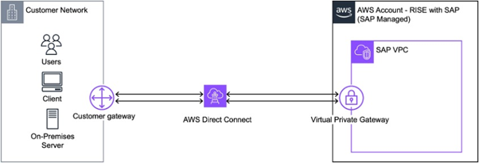
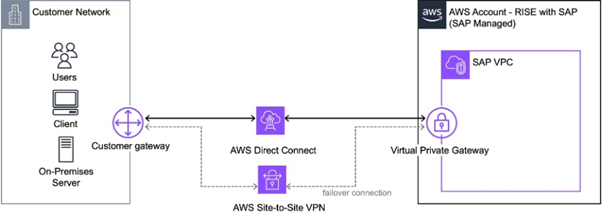

---
title: "Blog 2.Xây dựng kết nối mạng Hybrid đạt tiêu chuẩn cho doanh nghiệp trên AWS cho SAP Cloud ERP Private"
date: "2025-06-30"
weight: 1
chapter: false
pre: " <b> 3.2. </b> "
categories:
  [
    "AWS Direct Connect",
    "AWS Site-to-Site VPN",
    "AWS Transit Gateway",
    "Best Practices",
    "SAP on AWS",
  ]
authors: ["Zachary Daniels"]
---

## Giới thiệu

Bạn đã sẵn sàng khai phá toàn bộ tiềm năng của khối lượng công việc SAP trên AWS chưa? Hãy cùng giải quyết một trong những mảnh ghép quan trọng nhất: thiết lập khả năng kết nối mạng an toàn, đáng tin cậy giữa mạng công ty của bạn và các khối lượng công việc ERP trên cloud.

Tại AWS, khi hỗ trợ khách hàng triển khai **SAP Cloud ERP Private** (trước đây gọi là RISE with SAP), ba câu hỏi phổ biến luôn xuất hiện:

1.  “Làm sao để thiết lập kết nối an toàn với môi trường private cloud ERP?”
2.  “Kiến trúc mạng nào tiết kiệm chi phí nhất cho trường hợp của chúng tôi?”
3.  “Nên triển khai **Direct Connect, Site-to-Site VPN**, hay cả hai?”

Quyết định về kết nối mạng hôm nay sẽ ảnh hưởng đến hoạt động SAP của bạn trong nhiều năm tới, từ hiệu năng hệ thống cho đến khả năng khôi phục sau thảm họa. Trong hướng dẫn này, chúng tôi sẽ giúp bạn đơn giản hóa vấn đề và chỉ ra cách kết nối hạ tầng hiện có của bạn với AWS cho SAP Cloud ERP Private.

---

## Bắt đầu: Hiểu mô hình Trách nhiệm chia sẻ

Khi triển khai các khối lượng công việc cho SAP Cloud ERP Private, trách nhiệm được chia rõ ràng như sau:

- **SAP** chịu trách nhiệm quản lý môi trường AWS nơi Cloud ERP Private hoạt động.
- **Bạn** chịu trách nhiệm về **kết nối mạng** giữa hạ tầng của mình và môi trường SAP Cloud ERP Private trong AWS.

Điều này có nghĩa là bạn cần có chiến lược kết nối rõ ràng trước khi bắt đầu triển khai.

---

## Xác định nhu cầu kinh doanh của bạn

Thông thường, có ba điểm xuất phát chính khi triển khai SAP Cloud ERP Private:

1.  **Triển khai tập trung:** Ưu tiên sự đơn giản, cần giải pháp mạng đơn giản, an toàn để nhanh chóng bắt đầu kết nối.
2.  **Hạ tầng AWS sẵn có:** Bạn đã có kết nối AWS và muốn tích hợp SAP Cloud ERP Private vào kiến trúc mạng hiện tại.
3.  **Vận hành đa vùng:** Cần khả năng kết nối phức tạp, đa vùng, có khả năng kiểm soát và tự động hóa cao.

Cả ba cách đều đảm bảo bảo mật và độ tin cậy. Sự khác biệt chính nằm ở cách cân bằng giữa nhu cầu hiện tại, độ phức tạp vận hành, và khả năng mở rộng trong tương lai.

---

## Nội dung bài viết này

Chúng ta sẽ đi qua ba kiến trúc kết nối phù hợp với từng yêu cầu kinh doanh khác nhau:

1.  **Kiến trúc nền tảng:** Giải pháp kết nối tinh gọn, an toàn, dễ triển khai (cho doanh nghiệp cần triển khai nhanh).
2.  **Kiến trúc tích hợp:** Mô hình kết nối hybrid, tối ưu hóa tận dụng các hạ tầng AWS hiện có và cung cấp khả năng tự động chuyển đổi dự phòng.
3.  **Kiến trúc toàn diện:** Kiến trúc quy mô doanh nghiệp mang lại tính linh hoạt tối đa cho các triển khai phức tạp, đa vùng, kết hợp các phương pháp hay nhất của AWS (**AWS Landing Zone**).

---

## Option 1: Xây dựng kết nối quan trọng với AWS Direct Connect

Khi khối lượng công việc SAP của bạn đòi hỏi hiệu năng ổn định và độ trễ thấp, **AWS Direct Connect (DX)** là lựa chọn tối ưu. Giải pháp này cung cấp đường truyền mạng riêng, chuyên dụng giữa hạ tầng của bạn và SAP Cloud ERP Private trên AWS.

### Tại sao nên chọn Direct Connect?

Đối với môi trường SAP quan trọng, DX mang lại:

- Hiệu năng ổn định, độ trễ thấp.
- Hành vi mạng có thể dự đoán được.
- Băng thông chuyên dụng.
- Bảo mật tăng cường nhờ kết nối riêng.

### Nên sử dụng DX khi:

- Môi trường SAP production yêu cầu độ trễ thấp, hiệu năng ổn định.
- Có lưu lượng truyền dữ liệu lớn (trên 2TB/ngày).
- Cần thời gian phản hồi có thể dự đoán cho các tác vụ quan trọng.

### Các loại kết nối Direct Connect:

1.  **Hosted Connections:** Triển khai nhanh thông qua AWS Direct Connect Partners. Phù hợp cho hầu hết các triển khai SAP Cloud ERP Private.
2.  **Dedicated Connections:** Toàn quyền kiểm soát kết nối, hỗ trợ băng thông tùy chỉnh lên đến 100 Gbps. Dành cho workload lớn, nhạy cảm với độ trễ.

**Lưu ý bảo mật:** Cả hai loại kết nối đều không bao gồm mã hóa sẵn. Hãy cân nhắc triển khai **MacSec** để tăng cường bảo mật.

### Xây dựng kết nối có khả năng chịu lỗi (Resilient Connectivity):

Đối với các công việc quan trọng, nên triển khai nhiều kết nối DX để đạt được tính khả dụng cao.

- Sử dụng **AWS Direct Connect Resiliency Recommendations** để chọn mô hình tối ưu.
- Dùng **Direct Connect Resiliency Toolkit** để tạo kết nối dự phòng.

---

## Option 2: Tối ưu chi phí và độ tin cậy với Direct Connect + VPN Failover

Bằng cách kết hợp AWS Direct Connect với **Site-to-Site VPN**, bạn có thể xây dựng kiến trúc mạng hybrid có khả năng chịu lỗi cao, đồng thời cân bằng giữa hiệu năng và chi phí.

### Xây dựng chiến lược kết nối hybrid của bạn

- **Direct Connect** là đường truyền chính (hiệu năng ổn định).
- **AWS Site-to-Site VPN** đóng vai trò dự phòng tự động, cung cấp kết nối được mã hóa qua Internet nếu kết nối chính bị gián đoạn.

Cách tiếp cận này giúp bạn duy trì độ tin cậy cao mà không cần chi phí cho nhiều đường Direct Connect dư thừa.

### Bắt đầu với Site-to-Site VPN

Ưu điểm nổi bật là triển khai cực nhanh (chỉ trong vài ngày), cho phép đội ngũ của bạn bắt đầu làm việc với SAP Cloud ERP Private ngay lập tức.

Kết nối VPN mang lại:

- Mã hóa **IPSec** tích hợp sẵn để truyền dữ liệu an toàn.
- Băng thông linh hoạt, dựa vào đường Internet.
- Mô hình tính phí theo mức sử dụng (**pay-as-you-go**).

### Chọn lựa phù hợp cho doanh nghiệp của bạn

Mô hình hybrid này đặc biệt phù hợp với các tổ chức cần:

- Cân bằng giữa hiệu năng và ngân sách.
- Hỗ trợ văn phòng chi nhánh hoặc vùng có băng thông khác nhau.
- Thiết lập khả năng khôi phục sau thảm họa.

---

## Option 3: Xây dựng nền tảng doanh nghiệp với AWS Landing Zone

Khi SAP Cloud ERP Private là một phần trong chiến lược cloud tổng thể, việc triển khai **AWS Landing Zone** sẽ tạo ra một nền tảng có thể phát triển cùng doanh nghiệp.

### Vì sao nên cân nhắc phương pháp Landing Zone?

Landing Zone là một môi trường AWS đa tài khoản được thiết kế tốt và tuân theo các phương pháp hay nhất. Nó cung cấp:

- Kiểm soát và giám sát bảo mật tập trung.
- Kiến trúc mạng tiêu chuẩn hóa.
- Quản trị nhất quán trên nhiều vùng.
- Tùy chọn tích hợp linh hoạt.

**Landing Zone Accelerator (LZA)** là công cụ giúp triển khai nền tảng này một cách nhanh chóng và an toàn.

### Tạo môi trường kết nối của bạn

Bên trong Landing Zone, **AWS Transit Gateway** đóng vai trò là trung tâm điều phối lưu lượng mạng. Thiết kế này cho phép bạn:

- Kết nối nhiều VPC.
- Tích hợp các mạng on-premises.
- Triển khai các chính sách bảo mật thống nhất.
- Giám sát lưu lượng mạng tập trung.
- Mở rộng kết nối khi cần thiết.

### Ứng dụng thực tế

Các tổ chức triển khai cách tiếp cận Landing Zone khi họ:

- Cần duy trì các tiêu chuẩn bảo mật và tuân thủ nghiêm ngặt.
- Có kế hoạch mở rộng vượt ra ngoài các khối lượng công việc SAP cốt lõi (ví dụ: bổ sung IoT, phân tích dữ liệu, machine learning).
- Hoạt động trên nhiều khu vực địa lý.

---

## Tổng hợp lại: Xây dựng chiến lược mạng tối ưu của bạn

Các tùy chọn kết nối có thể kết hợp với nhau để tạo ra giải pháp toàn diện:

| Kết hợp                                    | Lợi ích Chính                                                                      | Phù hợp cho                                        |
| :----------------------------------------- | :--------------------------------------------------------------------------------- | :------------------------------------------------- |
| **DX + VPN** (Tùy chọn 1 + 2)              | Hiệu năng ổn định, khả năng chịu lỗi tích hợp sẵn, tối ưu chi phí.                 | Workload quan trọng, vị trí từ xa, cần dự phòng.   |
| **Landing Zone + DX** (Tùy chọn 3 + 1)     | Kiểm soát tối đa, mức độ sẵn sàng cao nhất, tiêu chuẩn bảo mật cấp doanh nghiệp.   | Kiểm soát tối đa, nền tảng sẵn sàng cho tương lai. |
| **Landing Zone + Hybrid** (Tùy chọn 3 + 2) | Kiến trúc có thể mở rộng, quản lý chi phí thông minh, chuyển đổi dự phòng tự động. | Tính linh hoạt, tối ưu chi phí, quản lý đơn giản.  |
| **Toàn diện** (Tùy chọn 1 + 2 + 3)         | Tối đa hóa tính linh hoạt, dự phòng hoàn toàn, phạm vi toàn cầu.                   | Doanh nghiệp lớn, yêu cầu cao nhất.                |

### Thực hiện: Các bước tiếp theo của bạn

1.  **Đánh giá yêu cầu của bạn:** Lập bản đồ các yêu cầu kết nối mạng, nhu cầu về hiệu năng, và khả năng mở rộng trong tương lai.
2.  **Lên kế hoạch cho phương pháp tiếp cận:** Chọn chiến lược kết nối phù hợp, xác định các giai đoạn triển khai và thiết lập mốc thời gian thực hiện.
3.  **Chuẩn bị cho việc triển khai:** Tạo các yêu cầu kỹ thuật chi tiết, liên hệ với AWS sớm và phát triển các kế hoạch kiểm thử.

---

## Tài nguyên bổ sung:

- Guidance for Building an Enterprise-Ready Network Foundation for RISE with SAP on AWS
- AWS Direct Connect + AWS Transit Gateway + AWS Site-to-Site VPN
- Connecting to RISE with SAP from on-premises networks
