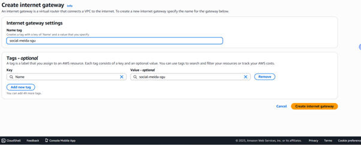
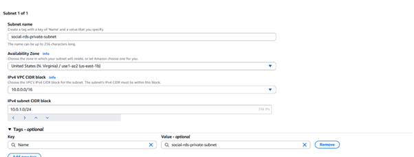
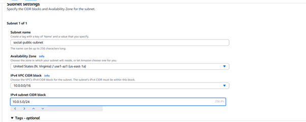

---
title: "Route 53 and VPC Network Configuration"
date: 2025-12-09T10:25:00+07:00
weight: 2
chapter: false
pre: "<b>5.3</b> "
---

This section covers domain registration, SSL/TLS certificate configuration, and setting up the Virtual Private Cloud (VPC) for backend resources.

## 3.1. Route 53 and ACM (SSL Certificate) Configuration

### 3.1.1. Domain Registration

1.  Go to the **Route 53** service and select **Register domain**.

2.  Enter the desired domain name and choose the domain extension type (e.g., select `.click` for affordability).

3.  Click **Select** and proceed to checkout.

4.  Enter contact information and click **Next**.

5.  Review the information and click **Submit** to finalize the purchase.

6.  The newly purchased domain appears in the list.

### 3.1.2. Create SSL Certificate using ACM

1.  Go to the **ACM (AWS Certificate Manager)** service, and select **Request a certificate**.

2.  Click **Next** (or keep the default **Public certificate**).

3.  Select the recently purchased domain and click **Request**. Note: two domain names are needed here (e.g., `social-sgu-media.click` and `*.social-sgu-media.click`).

4.  After the request, create CNAME records to validate the domain through Route 53.

### 3.1.3. Update Certificate and Domain for CloudFront

1.  Go back to the CloudFront Distribution, select the Distribution, and go to **Settings** (or **General**), then select **Edit**.

2.  Enter the purchased domain in the **Alternate domain names (CNAMEs)** field.

3.  Select the SSL certificate (**Custom SSL certificate**) created using ACM and click **Next**.

4.  Finally, click **Add domains** (or **Save changes**).

### 3.1.4. Create Route 53 Record pointing to CDN

1.  In Route 53, go to **Hosted zones**, select the purchased domain, and click **Create record**.
2.  Create the record: select **Type A**, choose **Alias** pointing to the **CloudFront Distribution**, and click **Create records**.

3.  Routing is successful. Verify by accessing the domain in the browser.

## 3.2. VPC (Virtual Private Cloud) Setup

### 3.2.1. Create VPC

1.  Go to the **VPC** service and click **Create VPC**.

2.  Set a name and choose an IP range (e.g., `10.0.0.0/16`).

3.  Click **Create**.

4.  VPC creation is successful.

### 3.2.2. Create and Attach Internet Gateway

1.  Create an **Internet Gateway (IGW)**.

2.  Creation is successful.

3.  Attach it to the newly created VPC (Attach to VPC).

4.  Attachment is successful.

### 3.2.3. Create Subnets

We create 4 Subnets: 2 Public Subnets (for ALB/NAT Gateway) and 2 Private Subnets (1 for ECS, 1 for RDS), each in 2 different Availability Zones to ensure high availability.

1.  Go to the **Subnets** tab and click **Create subnet**.
2.  **Private Subnet for RDS** (e.g., `Private-RDS-A`): Set a name, select the VPC, select the Availability Zone (AZ), and create an IP range (e.g., `10.0.10.0/24`).

3.  Click **Create**.

4.  Similarly, create the remaining 3 Subnets:
    - `Private-RDS-B` (Different AZ, different IP range)
    - `Private-ECS-A` (Different AZ, different IP range)
    - `Public-A` (Different AZ, different IP range)
    - `Public-B` (Different AZ, different IP range)

5.  The created Subnets are now available.

---
