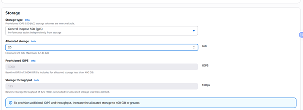
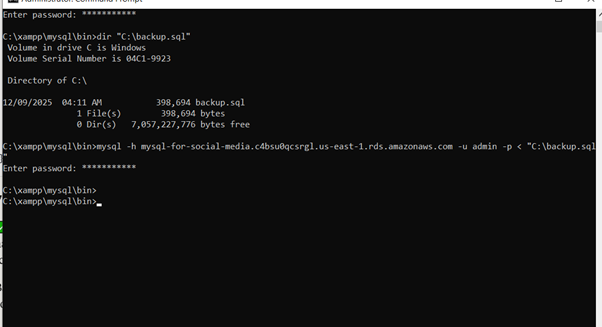

---
title: "Set up Subnet Group and RDS Database"
date: 2025-12-09T10:35:00+07:00
weight: 4
chapter: false
pre: "<b>5.5.</b> "
---

In this step, we will create a **DB Subnet Group** (mandatory for RDS) and then initialize **Amazon RDS (Relational Database Service)** for the backend database.

## 5.1. Create DB Subnet Group

1.  In the **RDS** service, go to the **Subnet Groups** tab, and click **Create DB Subnet Group**.

2.  Set a name (e.g., `social-media-db-subnet-group`), and select the created VPC.
3.  Select the 2 corresponding AZs and the 2 **Private Subnets** created for RDS (`Private-RDS-A` and `Private-RDS-B`).

4.  Subnet Group creation is successful.

## 5.2. Create RDS Database (MySQL)

1.  Go to the **RDS** service and click **Create database**.

2.  Select the **MySQL** Engine.

3.  Choose the version and select the **Free tier** **Template** to save costs.

4.  Set the Database name, the account name (**Master username**), and the password (**Master password**).

5.  Select the **DB instance class** as **t4g.micro** (Free tier).

6.  Select **Storage** as **gp3**.

7.  Select the VPC and the **Subnet Group** created above.

8.  In the **Public access** section, select **No** (since this is a Private Subnet).

9.  Then click **Create database**. Creation is successful.

### 5.2.1. Temporarily Modify Public Access and Migration

1.  To perform the initial database **migration**, we need to temporarily change **Public access** to **Yes** (DMS can be used for larger databases).

2.  Modification is successful.

3.  Perform Database Migration/Import: You can use MySQL Workbench or the Command Line.

4.  Verify by connecting MySQL Workbench to RDS. The database contains data.

