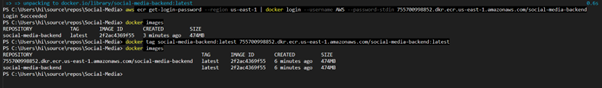
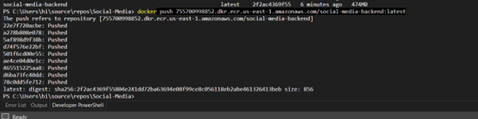
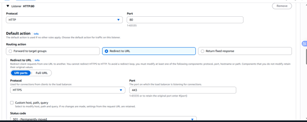
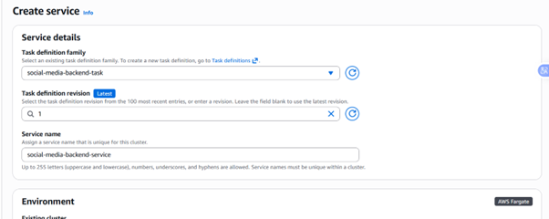

---
title: "ECR, Docker, Security Group, ALB, ECS Service và Kết thúc"
date: 2025-12-09T10:40:00+07:00
weight: 5
chapter: false
pre: "<b>5.6.</b> "
---

Đây là các bước cuối cùng để đóng gói ứng dụng Backend, tạo các thành phần bảo mật/Load Balancer và triển khai lên **ECS Fargate**.

## 6.1. Docker, ECR và Push Image

### 6.1.1. Tạo ECR (Elastic Container Registry)

1.  Vào dịch vụ **ECR** và tạo Repository (ví dụ: `social-media-backend`).

2.  Đã có ECR.

### 6.1.2. Dockerfile và Build Image

1.  Tạo **Dockerfile** ngang hàng với folder backend (sử dụng cấu trúc Onion).

2.  Cấu hình file Docker.

3.  Chạy lệnh `docker build -t social-media-backend .` để build. Đóng gói thành công.

### 6.1.3. Đăng nhập và Push Image lên ECR

1.  Đăng nhập vào ECR bằng command line, verify tag, kiểm tra lại bằng `docker image`.

2.  Chạy lệnh để push image lên ECR. Hoàn thành việc push.

## 6.2. Tạo Security Group

Ta tạo 3 Security Group: 1 cho ALB, 1 cho ECS/Backend, 1 cho RDS/Database.

### 6.2.1. Security Group cho ALB (Internet-Facing)

1.  Chọn **Create security group**. Đặt tên, chọn VPC đã tạo.
2.  Ở phần **Inbound rules**, chọn **HTTP** và **HTTPS** với **Source** là **mọi nơi** (`0.0.0.0/0` và `::/0`), ấn **Create**.

### 6.2.2. Security Group cho ECS (Backend)

1.  Đặt tên, chọn VPC. **Lưu ý:** Port của Dockerfile là **8080**, nên **Inbound rule** sẽ là **Custom TCP** Port **8080**.
2.  **Source** sẽ là **Security Group** của **ALB** vừa tạo (chỉ ALB được phép gửi traffic đến ECS).

### 6.2.3. Security Group cho RDS (Database)

1.  Đặt tên, chọn VPC. **Lưu ý:** **Inbound rule** sẽ là **Port MySQL** (3306).
2.  **Source** sẽ là **Security Group** của **ECS** vừa tạo (chỉ ECS được phép truy cập RDS).

3.  Tổng quan ta đã có 3 Security Group.

## 6.3. Tạo Target Group và ALB

### 6.3.1. Tạo Target Group

1.  Vào **EC2** -> **Target Group**, chọn **Create target group**.

2.  Chọn **Type** là **IP address**.

3.  Đặt tên, **Port** là **8080** (trong Dockerfile), chọn VPC đã tạo.

4.  Ở mục **Healthy threshold** chọn **2**, còn lại để mặc định và ấn **Create**.

5.  Hoàn thành việc tạo Target Group.

### 6.3.2. Tạo Application Load Balancer (ALB)

1.  Vào **EC2** -> **Load Balancers**, nhấn **Create Load Balancer**. Chọn loại **Application Load Balancer**.

2.  Đặt tên, chọn **Scheme** là **internet-facing**, **IP address type** là **Ipv4**.

3.  Ở **Network mapping**, chọn 2 AZ và 2 **Public Subnet** tương ứng.

4.  Ở **Security group**, chọn Security Group đã tạo cho ALB.

5.  Ở **Listeners**, ta tạo 2 Listener:
    - **Listener 1 (HTTP 80)**: Cấu hình trỏ đến HTTPS.

    * **Listener 2 (HTTPS 443)**: Ở **Routing action**, chọn **Forward to target group**, chọn Target Group vừa mới tạo.

6.  Ở phần cấu hình an toàn cho Listener (HTTPS), chọn **Certification** đã tạo ở phần Route 53 (ACM).

7.  Nhấn **Create**. Màn hình hiển thị tạo thành công.

## 6.4. Tạo ECS Cluster và Service

### 6.4.1. Tạo ECS Cluster

1.  Vào dịch vụ **ECS**, tab **Clusters**, nhấn **Create Cluster**.

2.  Đặt tên và chọn kiến trúc là **Fargate only**.

3.  Nhấn **Create**. Tạo thành công.

### 6.4.2. Cấu hình Task Definition

1.  Vào tab **Task definitions**, nhấn **Create new task definition**.

2.  Chọn tạo bằng file **JSON** (góc trên phải màn hình).

3.  Sử dụng cấu trúc file JSON chứa các thông tin như: image của ECR, port tương ứng, biến môi trường (kết nối database), và CORS (cho phép domain đã mua).

4.  Ấn **Create**. Tạo thành công.

### 6.4.3. Tạo ECS Service

1.  Vào Cluster vừa tạo, kéo xuống tab **Services** chọn **Create Service**.

2.  Ở **Service detail**, chọn **Task** mới tạo, đặt tên **Service name**.

3.  Ở **Environment**, chọn **Launch type** (Fargate).

4.  Ở **Deployment configuration**, để mặc định.

5.  Ở **Networking**, chọn VPC đã tạo, 2 **Private Subnet** tương ứng với ECS và tắt chức năng **Public IP**.

6.  Ở phần **Load balancing**, tick vào **Use load balancing**.
    - Sử dụng **ALB** đã tồn tại và dùng **Listener** đã tạo trước đó.

7.  Chọn **Target Group** đã tồn tại và chọn Target Group đã làm ở bước trước đó.

8.  Cuối cùng nhấn **Create**. Task đã chạy thành công.

### 6.4.4. Cấu hình Record Route 53 trỏ về ALB

1.  Tạo record Route 53, cấu hình trỏ đến **ALB** đã tạo. **Name** là `api` (ví dụ: `api.social-sgu-media.click`), và ấn **Create**.

2.  Tạo thành công.

## 6.5. Kết quả

Chạy thử với URL API đã cấu hình (ví dụ: `https://api.social-sgu-media.click/`).

Thành công! Vậy là ta đã hoàn thành xong Workshop triển khai ứng dụng Social Media trên AWS.
